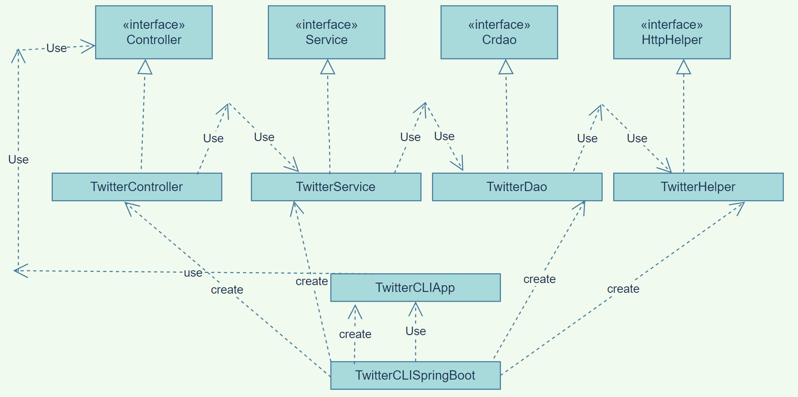

# Introduction
This project is designed to implement Twitter API(v1.1) to Create,Read and Delete the tweets. Technologies used in this project are Twitter Rest Api to make the desired  rest calls, HTTP client  to excecute each API requests , maven to build , Java libraries , and docker to upload the app.

# Quick Start
- mvn clean package - This will create the jar file in the target directry
- docker run [image name](here : jeshan26/twitter) post|show|delete [options]

# Design
## UML Diagram 
  
## TwitterCLISpringBoot creates all the beans(components) required by the app in the IOC Container.
TwitterCLIApp has the run method which accepts the args entered by the user. Controller class converts interacts and parses the user args  and returs the result. Service layer handles the business logic and calls the DAO layer in order to interact with the storage which is TwitterAPI in this case. Finally there is the DAO layer which interact with the HttpHelper interface to finally call the Twitter Api's. 
## Models
The actual tweet object is huge so we have implemented a shorthand of it by adding major properties like id, id_str, entities(object), coordiantes(object), and so on.
## Spring
- Spring is used to inject the dependencies automatically where required. Desired annotations are used(@component, autowired) which tells the spring to inject them. 

# Test
The application is well tested with the help of JUnit4, by testing each component. Moreover i have used Mockito for testing.

## Deployment
I have created a dockerfile which helps to build the docker image from jar file. Further, the image is pushed into the docker hub with the name (jeshan26/twitter). 

# Improvements
- Better structure and code readability.
